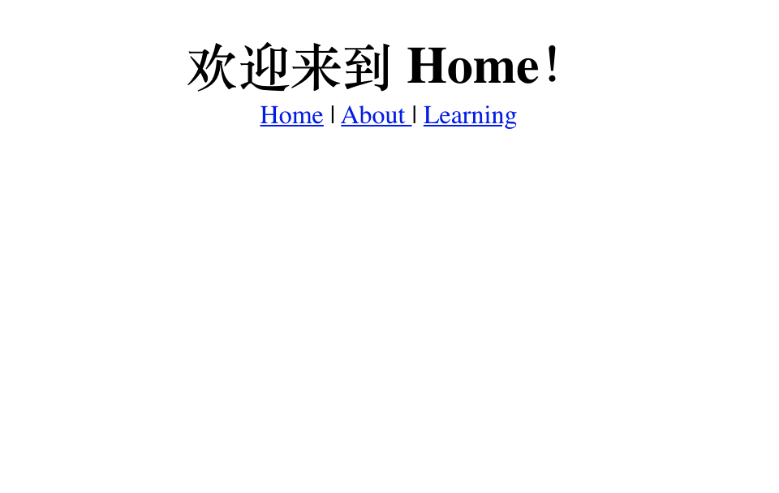

# 01 - Vue Routing 的指南

## 难度一：基本routing


安装 vue-router
```
yarn add vue-router 
```

新建文件夹 /router/index.js
```
import Vue from 'vue'
import Router from 'vue-router'
import Home from '../views/Home'
import About from '../views/About'

Vue.use(Router);

export default new Router({
  routes: [
    {
      path: '*',
      redirect: '/home',
    },
    {
      path: '/home',
      name: 'Home',
      component: Home,
    },
    {
      path: '/about',
      name: 'About',
      component: About,
    },
  ]
})
```

在 main.js 添加
```
import Vue from 'vue'
import App from './App.vue'
import router from './router'

Vue.config.productionTip = false

new Vue({
  router,
  render: h => h(App)
}).$mount('#app')
```

在 App.vue 里添加
```
<template>
  <div id="#app">
    <router-view></router-view>
  </div>  
</template>

<script>
export default {
  name: 'App',   
}
</script>
```
之后输入 /#/about 即可

选做：在 Home.vue 里添加
```
<template>
  <div>
    <h1> 欢迎来到 Home！ </h1>
    <router-link to='/home'> Home | </router-link> 
    <router-link to='/about'> About | </router-link>
  </div>
</template>
<script>

export default {
  name: 'Home',
}

</script>
```
恭喜完成！

## 难度二：带参数的 programmatic routing
使用push和replace
```
//
```


## 问题集
- [ ] router replace 和 push 的区别？

