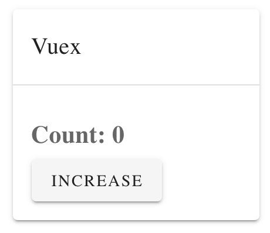
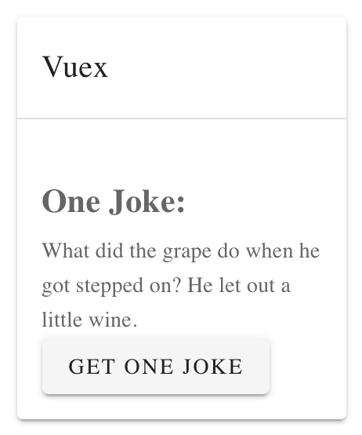

# Vuex

## 难度一：简单计数器


在最外层 main.js
```
import Vue from "vue"
import App from "./App.vue"
import vuetify from "./plugins/vuetify"
import store from "./store"

new Vue({
  vuetify,
  store,
  render: h => h(App)
}).$mount(#app)
```
新建文件夹 /store/index.js
```
import Vuex from 'vuex'
import Vue from 'vue'

Vue.use(Vuex)

export default new Vuex.Store({
  // 01 - state 
  state: {
    count: 1
  },
  
  // 02 - mutations, use "commit()"
  mutations: {
    increase(state){
      state.count ++;
    }

  },
    
  // 03 - getters, user "getters.func" 
  getters: {
    getCount(state){
      return state.count;
    }
  },


})
```

在主要的 App.vue
```
<template>
  <div>
    <h2 style="margin-bottom: 10px"> Count: {{count}} </h2>
    <v-btn @click="increaseCount"> increase </v-btn>
  </div>
</template>
```
```
<script>

export default {
  name: "LearnJS",

  computed: {
    count(){
      return this.$store.getters.getCount;
    },
    
  },

  methods: {
    increaseCount(){
        this.$store.commit('increase');
    },
    
  }
};
  
</script>
```

## 难度二：获取URL笑话集


在main.js相同的代码  

在/store/index.js里添加 actions
```
export default new Vuex({
  
  // 01 - state
  state: {
    oneJoke: '',
  },
  
  // 02 - mutations（针对普通function）
  mutations: {
    setJoke(state, payload){
      state.oneJoke = payload;
    },

  },
  
  // 03 - actions (针对async）
  actions: {
    async getJoke(state){
      const promise = await fetch(url, {headers});
      const res = await promise.json();
      console.log(res.joke);
      state.commit('setJoke', res.joke);
    }
  },

  // 04 - getters
  getters: {
    getJoke: state => state.oneJoke,
  }
  
})
```

在 App.vue 用 mapAction 简化
```
<template>
  <div>
    <h2 style="margin: 10px 0px">One Joke: </h2>
    <p>{{joke}}</p>
    <v-btn @click="getJoke2"> get joke </v-btn>
  </div>
</template>
```
```
<script>

import {mapActions} from 'vuex'

export default {
  name: "LearnJS",

  computed: {
    joke(){
      return this.$store.getters.getJoke;
    },
   
  },

  methods: {
    ...mapActions(['getJoke']),

    getJoke2(){
      this.getJoke();
    },

    getJoke1(){
      this.$store.dispatch('getJoke');
    },

  }

};
  
</script>
```

完成！


