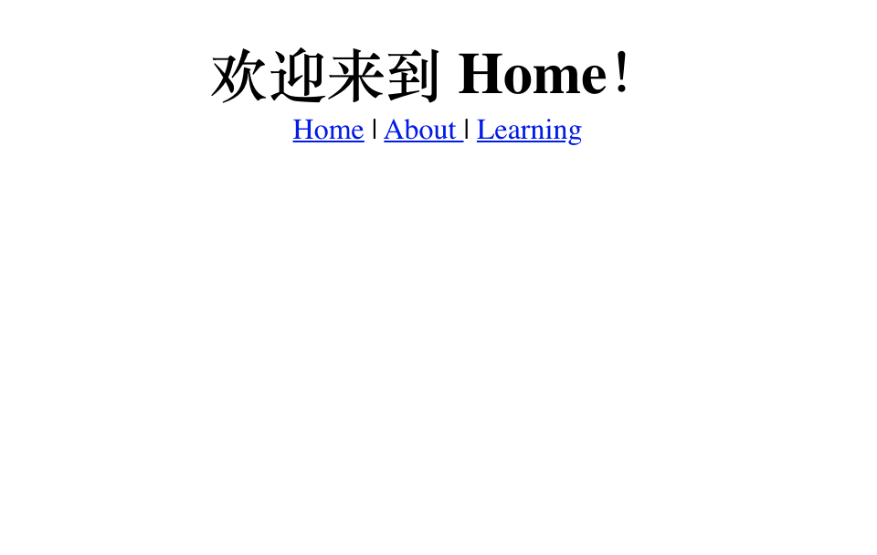

# 如何添加 Vue Routing？

## 第一部分：基本routing


安装 vue-router
```js
yarn add vue-router 
```

新建文件夹 /router/index.js
```js
import Vue from 'vue'
import Router from 'vue-router'
import Home from '../views/Home'
import About from '../views/About'

Vue.use(Router);

export default new Router({
  routes: [
    {
      path: '*',
      redirect: '/home',
    },
    {
      path: '/home',
      name: 'Home',
      component: Home,
    },
    {
      path: '/about',
      name: 'About',
      component: About,
    },
  ],
  mode: "history" // 就不用输入 # 了
})
```

在 main.js 添加
```js
import Vue from 'vue'
import App from './App.vue'
import router from './router'

Vue.config.productionTip = false

new Vue({
  router,
  render: h => h(App)
}).$mount('#app')
```

在 App.vue 里添加
```js
<template>
  <div id="#app">
    <router-view></router-view>
  </div>  
</template>

<script>
export default {
  name: 'App',   
}
</script>
```

选做：在 Home.vue 里添加
```js
<template>
  <div>
    <h1> 欢迎来到 Home！ </h1>
    <router-link to='/home'> Home | </router-link> 
    <router-link to='/about'> About | </router-link>
  </div>
</template>
<script>

export default {
  name: 'Home',
}

</script>
```
恭喜完成！


## 第二部分：带参数的 programmatic routing
route 的 index.js
```js
import Vue from 'vue'
import Router from 'vue-router'
import Resume from '../components/Resume.vue'

Vue.use(Router);

export default new Router({
  routes: [
    {
      path: '*',
      name: 'BytoWeb',
      beforeEnter() {
        window.location.href = "https://byto.tech";
      }
    },
    {
      path: '/resume/:id',
      name: 'Resume',
      component: Resume
    },
  ],
  mode: "history"
})
```

在data()里面
```js
id: this.$route.params.id
```
就可以了！


## 问题集
Veutify: Unable to locate target data-app -> 在App.vue 的 div 上 添加 data-app 就好. 


v-img doesn't display? -> :src="require('')"


