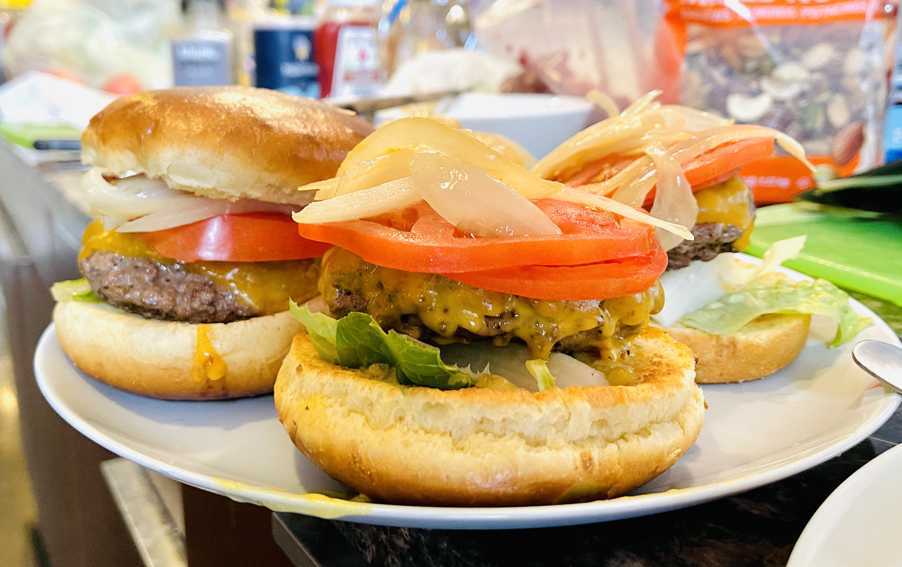
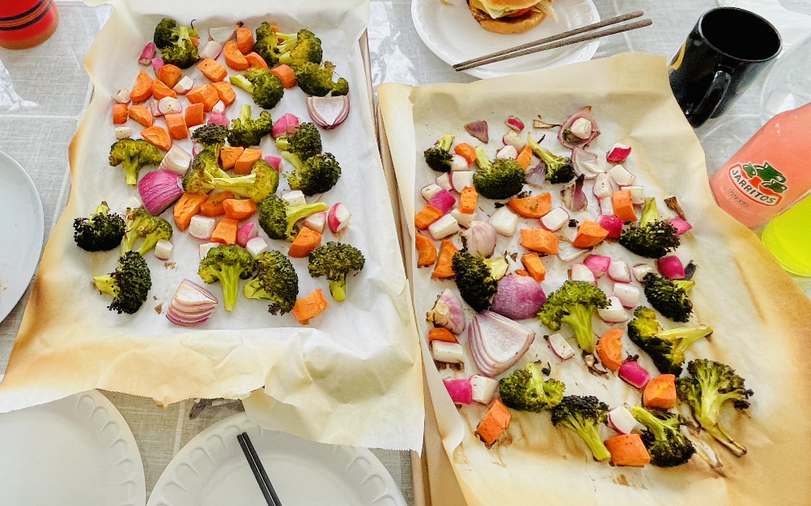

### 牛肉馅汉堡
- B站视频：[链接](https://www.bilibili.com/video/BV1g541157vC/?spm_id_from=333.337.search-card.all.click)。
- 0）调料，千岛酱，黄色mastard，番茄酱，酸黄瓜丁。黄色酱少加点要不黄了。
- 面包片拧到1-2中间烤一烤。
- 1）洋葱切四个半圆形，然后切丝。炒洋葱10min焦黄色，加盐，加黄油。
- 2）肉馅捏球，薄一点好熟。单面放盐和胡椒。
- 3）视频说3min，但单面5min好一些，另一面可10min。

### 烤蔬菜
- B站视频：[链接](https://www.bilibili.com/video/BV1uq4y1k7Va/?spm_id_from=333.337.search-card.all.click)。
- 425度 20min不是太烂，有点干，应该多放油，盐和胡椒。洋葱、西蓝花、reddish萝卜，胡萝卜（可以不用）。

