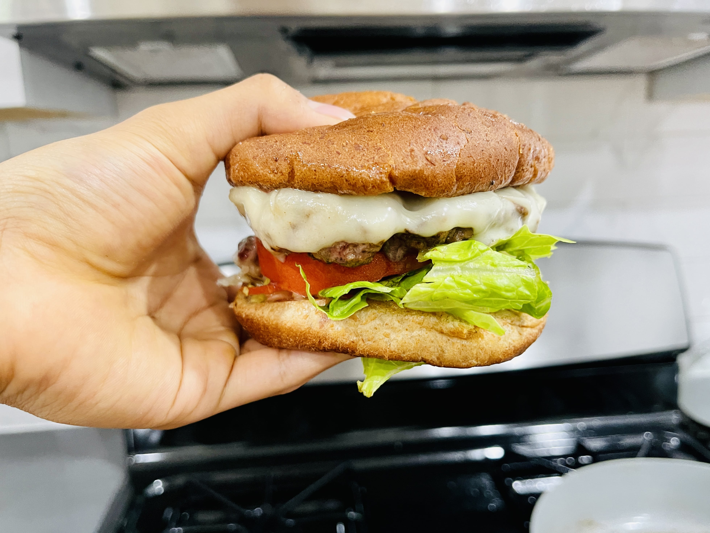
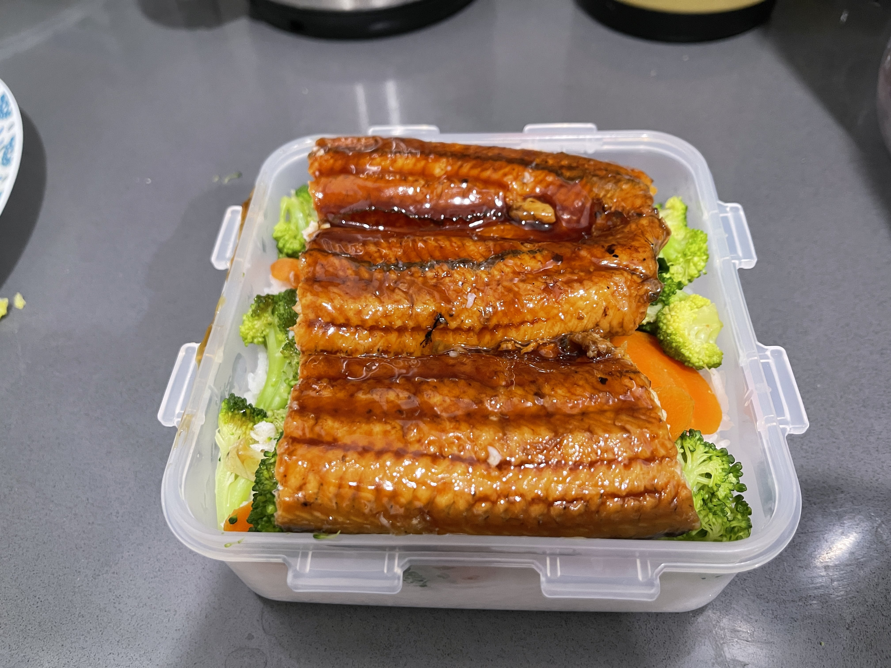
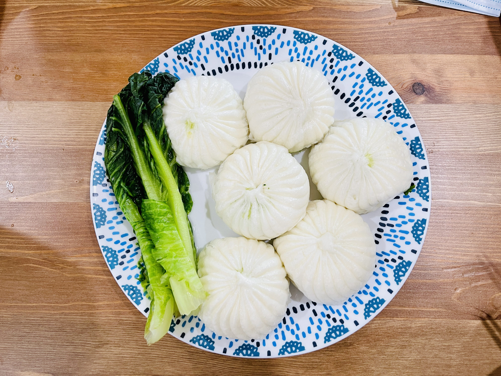
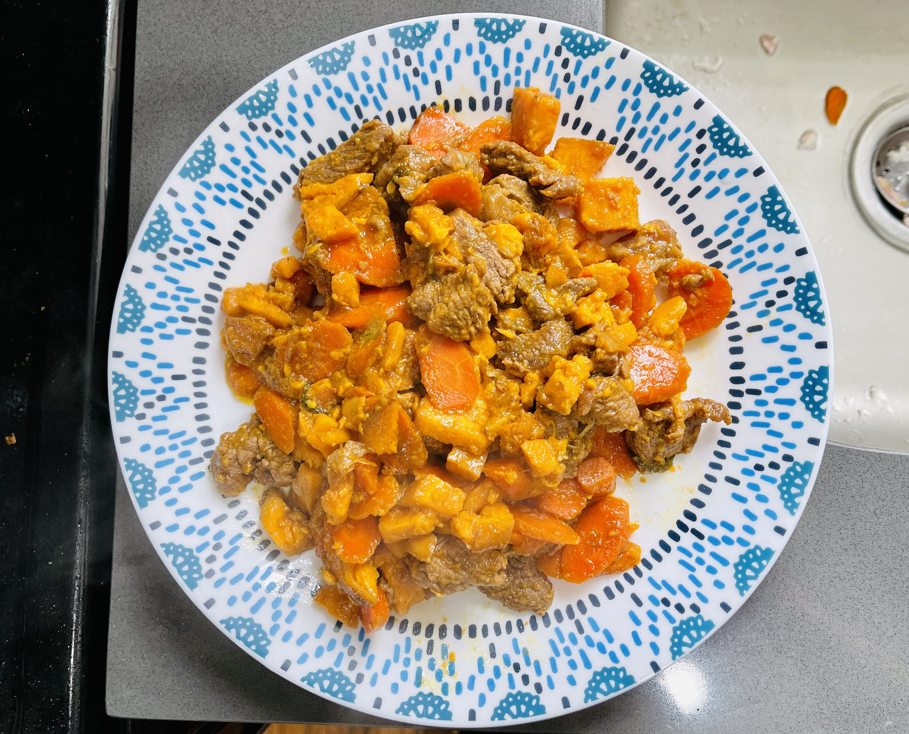
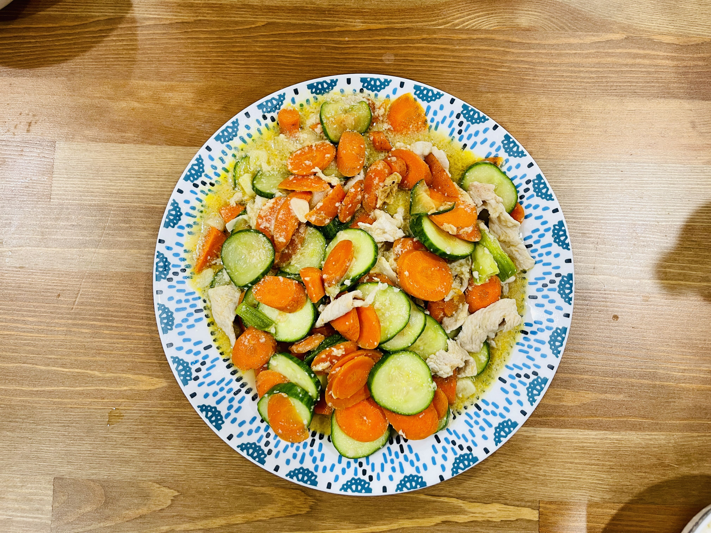
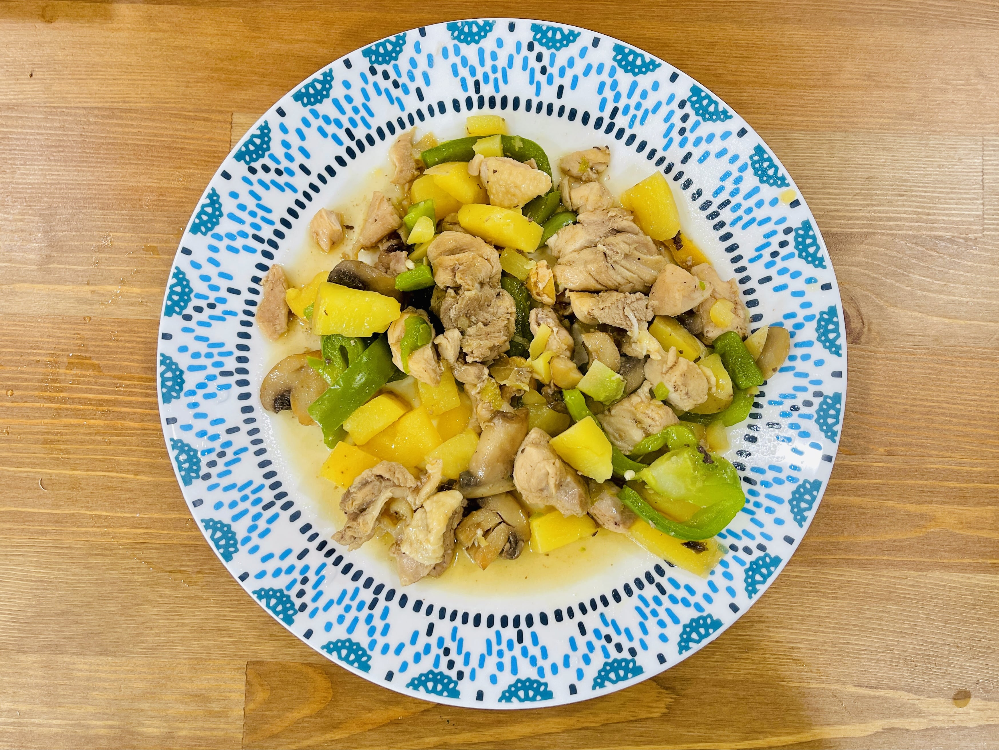

# Cooking recipes for busy students

## 早餐
- 麦片 2 - 2.5 min
- 鸡蛋涂抹面包 2.5 min
- 生菜面包 2 min
- 白煮鸡蛋，水烧开 8 min 或 10 min
- 三文鱼，鱼皮面 4 min，翻过来 4 min，加照烧酱 1 min；可以中小火
- 鸡扒，单面 3 + 3，盖盖子 5 min

## 午餐
- 化冻肉，水龙头冷水滴答 20 min
- 土豆牛肉，切小块肉用餐巾纸擦干，切一根葱 三片姜，
    - 半锅底油，翻炒葱姜 1 min，再加肉炒 2 min，
    - 加酱油上色，加水盖盖子，中火 20 min （30 min 更好）
    - 加土豆和胡萝卜，10 min
    - 小火 5 min

## 快速食物

## 正餐食物

